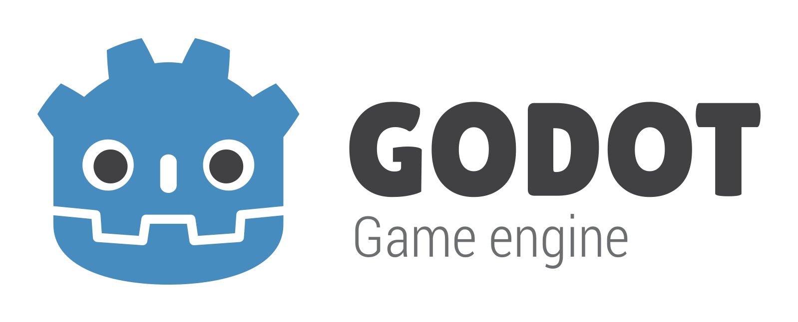

{: width="400"}

[Godot](https://godotengine.org) ist eine Feature reiche 2D & 3D Game Engine. Godot setzt auf eigene Skriptsprache namens *GDScript*, mit deren Hilfe Spielmechanik und Struktur implementiert werden. Eine umfangreiche Online Dokumentation findet sich [hier](https://docs.godotengine.org/en/stable/index.html).
