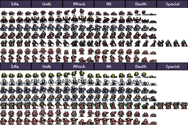
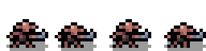

# Sprite Sheets

Sprites sind 2D Grafiken, welche in der Regel im `.png` Format vorliegen und zur Darstellung von Objekten innerhalb der Spielwelt verwendet werden. Sprites können entweder als statische Grafiken oder als Animationen mit beliebig vielen Animationsphasen vorliegen.

!!! hint "Namenskonvention"
    Sprites jeder Art beginnen mit dem Präfix `spr_`. Animierte Sprites werden mit einem Suffix `_stripXX` versehen, wobei `XX` durch die Zahl der Animationsphasen ersetzt wird. Handelt es sich um eine Zahl zwischen 1 und 9 wird diese als `0X` angegeben. Dieses Suffix erleichtert den Import der Animationen in *GMS2*.

    Beispiel: `spr_goblin_strip04` für einen animierten Sprite mit 4 Animationsphasen.

Quelldateien, welche als externe Ressourcen für das Projekt gekauft oder aus anderen Quellen herunter geladen wurden, liegen zumeist als eine Matrix aus verschiedenen Sprites in den Zeilen mit den jeweiligen Animationsphasen in den Spalten vor. Jedes Einzelbild hat dabei

{: width="800" }
**Beispiel Sprite Sheet von itch.io**

Das oben gezeigte Beispiel enthält 14 verschiedene Sprites, welche jeweils eine 4 Phasen Animation für die Aktionen *Idle*, *Walk*, *Attack*, *Hit* und *Death* haben.
Diese Matrix muss im Laufe des Workflows in Einzelanimationen unterteilt werden, welche nach den Namenskonventionen im entsprechenden Unterordner abgespeichert werden müssen.

{: width="800" }
**Einzelanimation in 4 Phasen**

## Importieren von Sprite Sheets

*ASEPRITE* bietet einen einfachen Workflow um Quelldateien im oben beschriebenen Format zu importieren und zur weiteren Verarbeitung aufzubereiten.

1. Öffnen der Quelldatei mit `File > Import Sprite Sheet` oder `CMD + I`
2. Auswahl der Quelldatei mit `Select File`
3. Auswahl des zu importierenden Abschnitts mit `Type`.
    - Horizontal / Vertical Strip -> Eignet sich am besten, um bestimmte Teile des Sheets zu lesen
    - By Rows / Columns importiert das gesamte Sheet und sortiert die erzeugten Kacheln nach Zeilen oder Spalten
4. Eingabe `X` und `Y` für die Koordinaten des ersten Pixels, der zu importieren ist. Eignet sich um Ränder abzuschneiden
5. Eingabe `Width` / `Height` für die entsprechenden Maße einer einzelnen Kachel
6. Checkbox Padding mit `X` und `Y`, falls leere Pixel zwischen den einzelnen Kacheln sein sollten
7. Bestätigen mit `Import`

!!! Hint "Hinweis"
    Die aktuelle Auswahl des zu importierenden Bereichs innerhalb eines Sprite Sheets wird durch den ausgegrauten bzw. hervorgehobenen Bereich, sowie die Hilfslinien dargestellt.

## Aufbereiten einzelner Charaktere und Animationen

Hier geht's weiter ...

## Exportieren von GIF's

Hier auch ..
